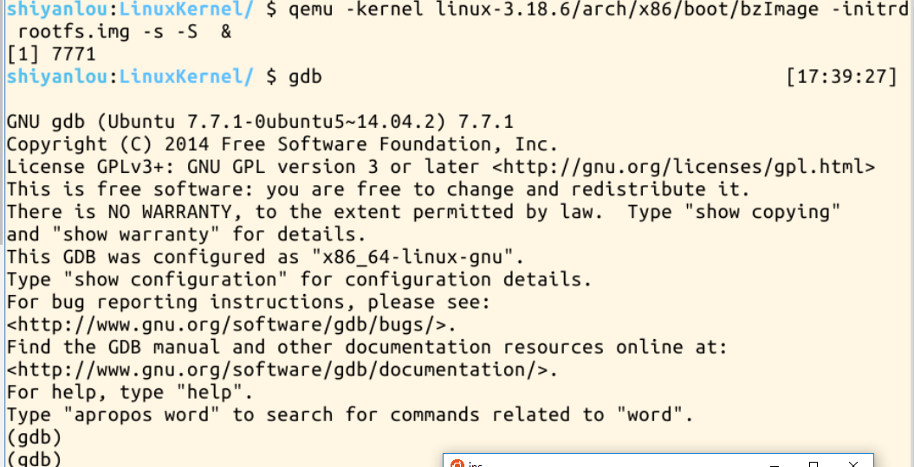
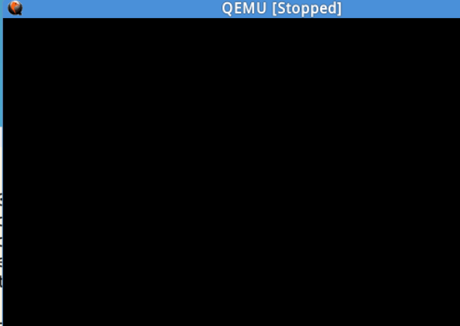
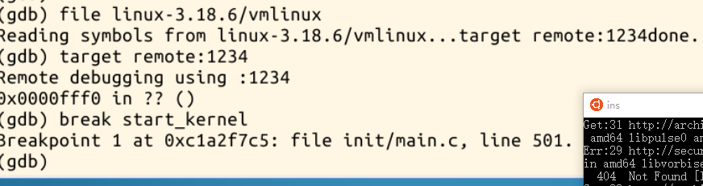
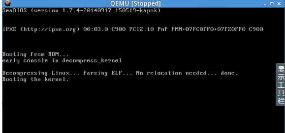
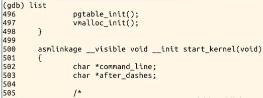
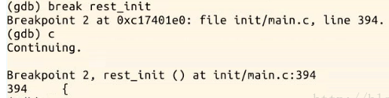
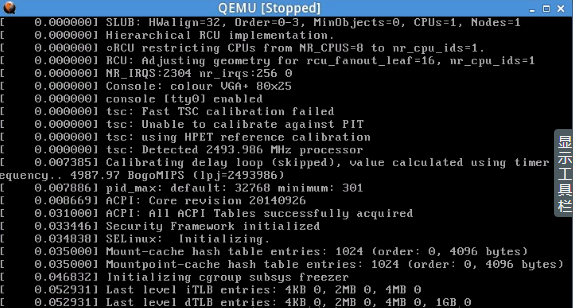
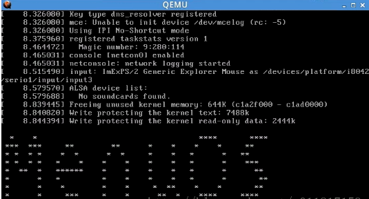

# 追踪linux的启动过程
>一篇使用gdb,qemu来追踪linux启动过程中的关键事件的报告

## 环境
我是在`实验楼`这个网站上进行实验的, 那里有专门的<<linux内核分析>>实验,部署好了环境,比如安装了qemu,下载好了linux kernal
[这是网址](https://www.shiyanlou.com/courses/)

* linux
* zsh

## 工具
### make
读入makefile, 然后执行指定的指令,适合管理,编译大项目
### qemu
qemu是一个优秀模拟处理器,可以用来模拟操作系统
### gdb
gdb是GNU项目的debugger,功能强大.主要有如下功能
* 使程序以你想要的方式运行
* 可以设置断点使被调试的程序执行到断点处停止
* 当程序停住,可以检查此时程序所发生的事情
* 动态的改变程序的执行环境
这是常用参数:
```
    (gdb) b（breakpoint）:用法：b 函数名 ：对此函数进行中断 ；b 文件名：行号；
    (gdb) run：启动程序，运行至程序的断点或者结束；
    (gdb) l(list):l，显示当前行后面的源码；
    (gdb) s(step):进入函数，逐语句运行；
    (gdb) n(next):不进入函数，逐过程运行；
    (gdb) c（continue）：继续运行，跳至下一个断点；
    (gdb) p（print）：打印显示变量值；
    (gdb) set variable=value,为变量赋值；
    (gdb) kill：终止调试的程序；
    (gdb) h（help）：列出gdb详细命令帮助列表；
    (gdb) clear filename.c:30：清除30行处的断点；
    (gdb) info break：显示断点信息；
    (gdb) delete 断点编号：断点编号是info break 后显示出来的；
    (gdb) bt（backtrace）：回溯到段出错的位置；
    (gdb) frame 帧号：帧号是bt命令产生的堆栈针；
    (gdb) q：退出
```

## 步骤
### 编译
```shell
cd linux-3.18.6   
make allnoconfig
make 

# 制作根文件系统
mkdir rootfs
git clone https://github.com/mengning/menu.git  
cd menu
gcc -o init linktable.c menu.c test.c -m32 -static –lpthread
cd ../rootfs
cp ../menu/init ./
find . | cpio -o -Hnewc |gzip -9 > ../rootfs.img
#制作好的rootf.img 已上传至repo
```
### 启动qemu



用`&`使qemu后台运行
此时qemu模拟启动操作系统处于暂停状态



### 启动gdb调试追踪



输入c,执行到断点(start_kernel)停止



输入list,显示后面的代码



继续设置断点
`break rest_init`





最后启动的页面



## 总结
两个重要的函数
### start_kernel
Linux内核启动的时候首先会调用start_Kernel函数，在start_kernel函数中会调用大量的init函数来对内核环境进行初始化；包括CPU初始化、内存管理初始化、进程管理初始化、文件系统初始化、中断、同步互斥等。
### rest_init
在start_kernel函数完成初始化之后，然后调用rest_init()函数来启动第一个用户进程，该进程被称为1号进程。
* 0号进程:是所有进程的父进程，在内核启动之前，0号进程完全变成idle进程，系统开始无限循环
* 1号进程:又称“init进程”，由0号进程在start_kernel调用rest_init创建。init进程的PID为1，当调度进程选择到init进程时，init进程开始执行kernel_init()函数
