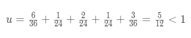

**<span style="float:right">PB16030899-朱河勤 <br>2018-3-21<span>**
# <center>作业调度

##作业集
作业|剩余时间|耗费时间
:-:|:-:|:-:
osh调研报告|1.5天|6小时
计算方法|1天|1小时
计算机组成原理作业|1天|2小时
毛概课堂展示|1天|8小时
汇编学习8086,x86,mips|36天|3天
## 可调度性


可以调度

## 调度方法
先后顺序依次为: 计算机组成原理, 计算方法,毛概展示,osh调研报告,汇编学习


## 作业切换伪代码
如,要完成计算方法与毛概
```
加载主程序(开始做作业)

将主程序的返回地址存于返回地址寄存器

#调用计算方法
将计算方法的地址加载到pc,
完成计算方法,可能调用其他子进程,比如学习newton插值,此时会将计算方法的返回地址(即下一条指令)存于栈中

将pc设为返回地址寄存器的值,即跳转回父进程

#调用毛概
将计算方法的地址加载到pc,
完成计算方法,可能调用其他子进程,比如学习newton插值,此时会将计算方法的返回地址(即下一条指令)存于栈中

将pc设为返回地址寄存器的值,即跳转回父进程

完成各项作业,结束

```
